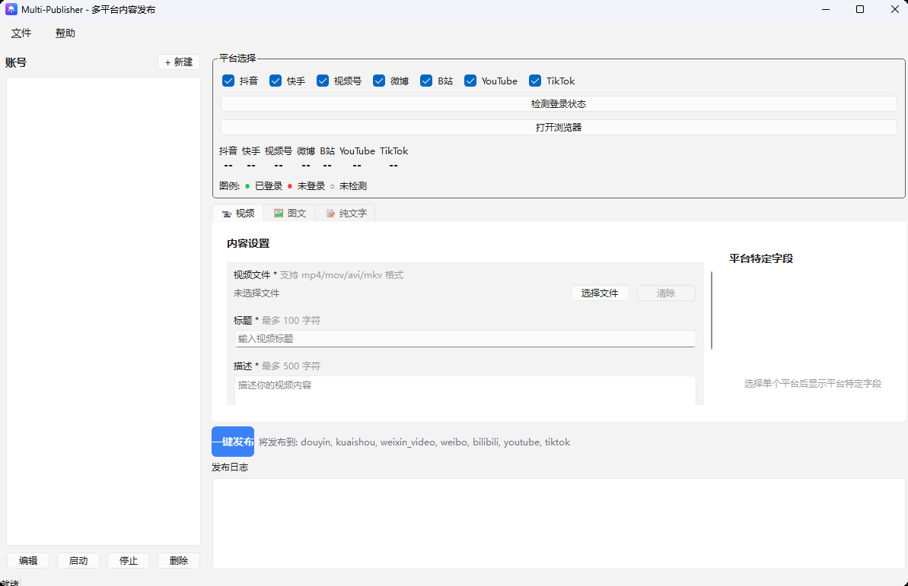
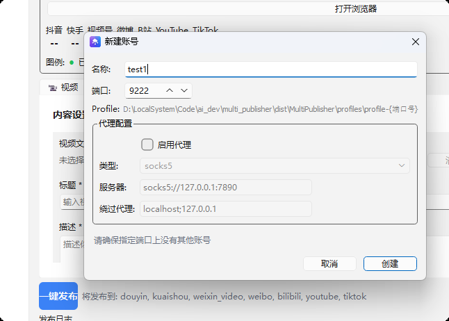
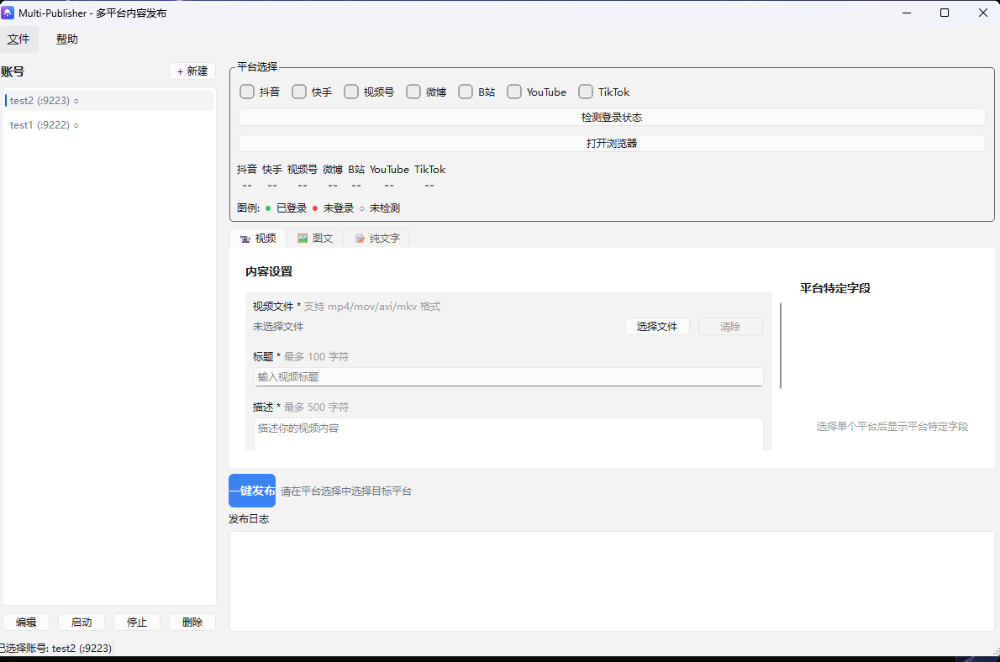

# Multi-Publisher

> 一键发布到微博、抖音、快手、视频号...让内容创作更简单

多平台内容一键发布工具，支持微博、抖音、快手、视频号、哔哩哔哩、YouTube、TikTok 等多个主流平台。

---

## 痛点

作为内容创作者，你是否也遇到过这些烦恼？

- **多平台运营**：同时运营多个平台，重复发布让人崩溃
- **手动上传**：每个平台都要打开网页、登录、上传、填写描述...繁琐耗时
- **效率低下**：每次发布内容要花费大量时间在重复操作上

---

## 解决方案

Multi-Publisher 让你**一次编辑，一键发布到所有平台**。

### 核心功能

- **多平台支持**：微博、抖音、快手、视频号、哔哩哔哩、YouTube、TikTok 等
- **可视化操作**：直观的图形界面，三步完成发布
- **账号隔离**：独立浏览器环境，数据完全隔离
- **批量发布**：一次编辑，同时发布到多个平台
- **账号矩阵**：支持多个账号，对于海外平台我还单独提供了设置代理的功能

---

## 支持的平台

| 平台 | 状态 | 说明 |
|------|------|------|
| 微博 | ✅ 完善 | 视频上传 |
| 抖音 | ✅ 完善 | 视频上传 |
| 快手 | ✅ 完善 | 视频上传 |
| 视频号 | ✅ 完善 | 视频上传 |
| 哔哩哔哩 | ✅ 完善 | 视频上传 |
| YouTube | ✅ 完善 | 视频上传 |
| TikTok | ✅ 完善 | 视频上传 |

---

## 快速开始

在与我取得联系并获得完整的程序后即可开始使用

---

## Roadmap

- [ ] 图文发布功能
- [ ] 定时发布
- [ ] 发布记录管理
- [ ] 更多平台支持

---

## 交流与联系

| 方式 | 说明 |
|------|------|
| ⭐ Star | 你的支持是我更新的动力 |
| 微信 | 感兴趣可加微信私聊（qwertbulingbuling，也可以下面扫码） |

> ⭐ **加我微信**：对项目感兴趣或有定制需求，可以加我微信私聊，备注「Multi-Publisher」。
>
> 关于此项目，我会以买断制的形式出售，并且在我这里购买的项目我将提供后续的项目支持包括优先参考他们提供的项目需求建议，尽量别砍价，赚点生活费，太穷快搞不起技术了呜呜呜
>
> 

---

同时你也可以考虑关注我，如果你对网络安全和AIGC感兴趣。

这是我的blog：https://blog.csdn.net/l_l_c_q?spm=1010.2135.3001.5343

这是我的微信公众号：AIGC&Security

没人关注都快没发文章的动力了

最后，给个star让我🛫吧

## 许可证

本项目采用 [MIT License](LICENSE) 开源。

---

