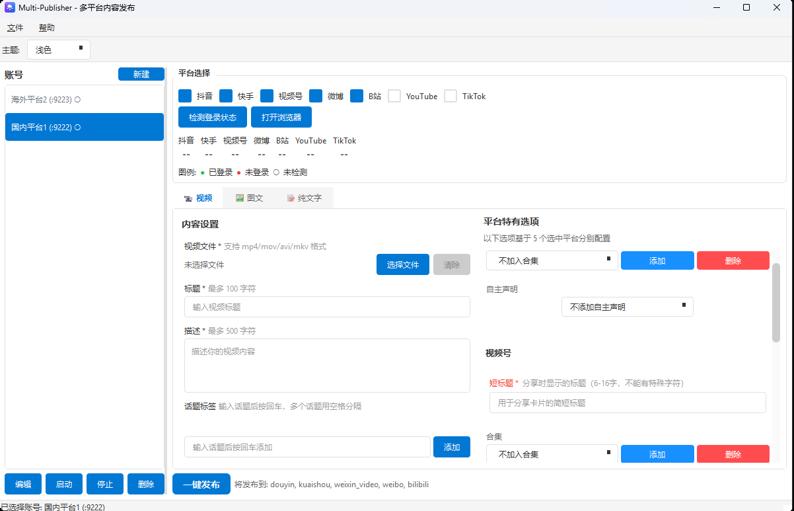

# Multi-Publisher

> 一键发布到微博、抖音、快手、视频号...让内容创作更简单

多平台内容一键发布工具，支持微博、抖音、快手、视频号、哔哩哔哩、YouTube、TikTok 等多个主流平台。

---

## 痛点

作为内容创作者，你是否也遇到过这些烦恼？

- **多平台运营**：同时运营多个平台，重复发布让人崩溃
- **手动上传**：每个平台都要打开网页、登录、上传、填写描述...繁琐耗时
- **效率低下**：每次发布内容要花费大量时间在重复操作上

---

## 解决方案

Multi-Publisher 让你**一次编辑，一键发布到所有平台**。

### 核心功能

- **多平台支持**：微博、抖音、快手、视频号、哔哩哔哩、YouTube、TikTok 等
- **可视化操作**：直观的图形界面，三步完成发布
- **账号隔离**：独立浏览器环境，数据完全隔离
- **批量发布**：一次编辑，同时发布到多个平台
- **账号矩阵**：支持多个账号管理
- **多主题支持**：支持浅色、深色、高对比度、护眼浅色四种主题
- **代理配置**：支持为海外平台配置代理

---

## 支持的平台

| 平台 | 状态 | 说明 |
|------|------|------|
| 微博 | ✅ 完善 | 视频上传 |
| 抖音 | ✅ 完善 | 视频上传 |
| 快手 | ✅ 完善 | 视频上传 |
| 视频号 | ✅ 完善 | 视频上传 |
| 哔哩哔哩 | ✅ 完善 | 视频上传 |
| YouTube | ✅ 完善 | 视频上传 |
| TikTok | ✅ 完善 | 视频上传 |

---

## 界面预览

### 主题切换

支持四种主题风格，可根据喜好自由切换：

- **浅色**：默认蓝白主题
- **深色**：暗色背景，夜间使用
- **高对比度**：无障碍设计，黄黑高对比
- **护眼浅色**：暖色调，适合长时间阅读

---

## 快速开始

在与我取得联系并获得完整的程序后即可开始使用

---

## Roadmap

- [x] 视频发布功能
- [ ] 素材管理
- [ ] 图文发布功能
- [ ] 定时发布（需先完成素材管理）
- [ ] 发布记录管理
- [ ] 更多平台支持

---

## 交流与联系

| 方式 | 说明 |
|------|------|
| ⭐ Star | 你的支持是我更新的动力 |
| 微信 | 感兴趣可加微信私聊（qwertbulingbuling，也可以下面扫码） |

> ⭐ **加我微信**：对项目感兴趣或有定制需求，可以加我微信私聊，备注「Multi-Publisher」。
>
> 
>
> 

---

同时你也可以考虑关注我，如果你对网络安全和AIGC感兴趣。

这是我的blog：https://blog.csdn.net/l_l_c_q?spm=1010.2135.3001.5343

这是我的微信公众号：AIGC&Security

最后，给个star让我🛫吧

---

