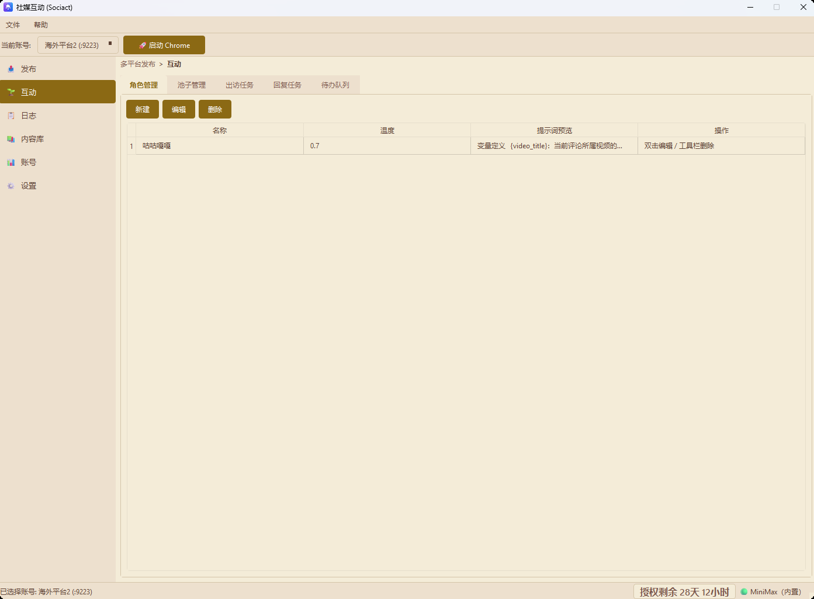
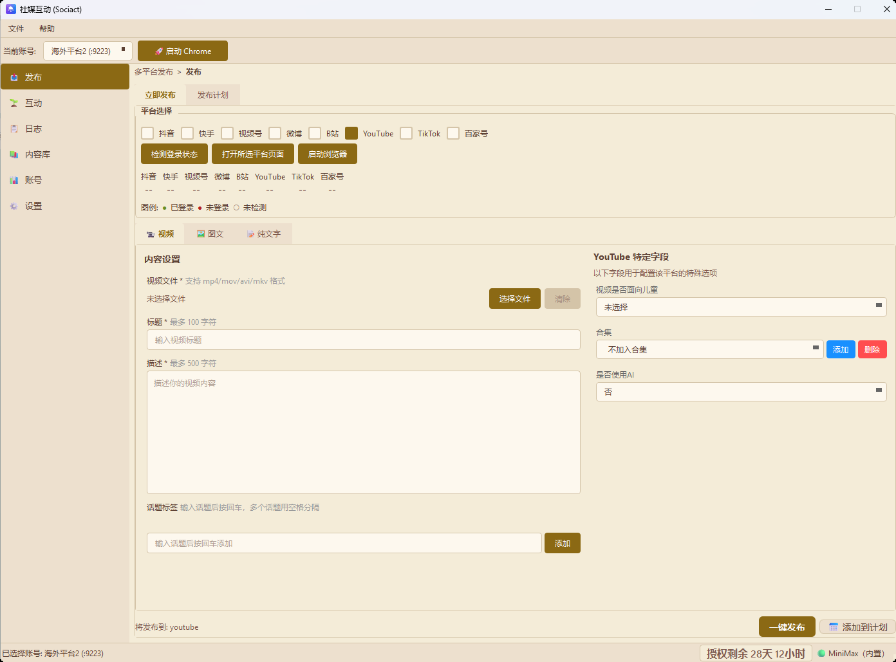
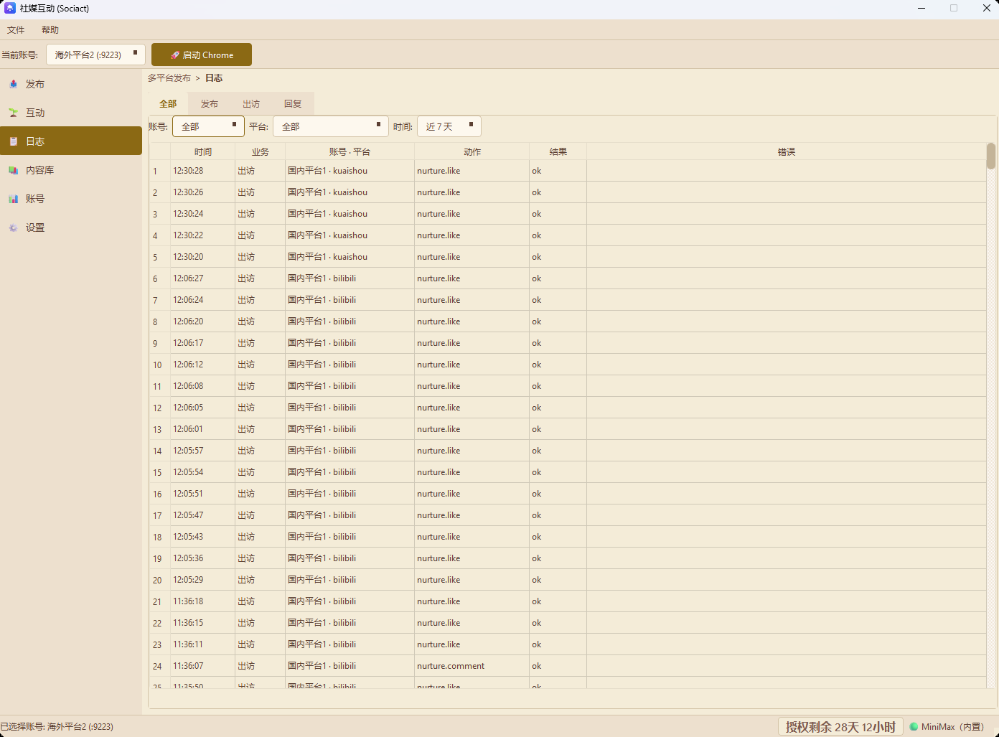

# Socicat

> 一键发布到微博、抖音、快手、视频号...让内容创作更简单

Socicat，支持微博、抖音、快手、视频号、哔哩哔哩、YouTube、TikTok 等多个主流平台。

---

## 痛点

作为内容创作者，你是否也遇到过这些烦恼？

- **多平台运营**：同时运营多个平台，重复发布让人崩溃
- **手动上传**：每个平台都要打开网页、登录、上传、填写描述...繁琐耗时
- **效率低下**：每次发布内容要花费大量时间在重复操作上
- **养号困难**：账号需要持续互动才能获得流量，但手动操作费时费力

---

## 解决方案

Socicat 让你**一次编辑，一键发布到所有平台**，并提供**自动化养号**能力，模拟真实用户行为。

### 核心功能

- **多平台发布**：微博、抖音、快手、视频号、哔哩哔哩、YouTube、TikTok 等
- **可视化操作**：直观的图形界面，三步完成发布
- **账号隔离**：独立浏览器环境，数据完全隔离
- **批量发布**：一次编辑，同时发布到多个平台
- **账号矩阵**：支持多个账号管理
- **自动养号**：模拟真实用户行为，支持浏览、点赞、评论、关注、搜索互动
- **定时任务**：支持每日、每周、Cron 表达式三种定时策略，自动执行养号
- **多主题支持**：支持浅色、深色、高对比度、护眼浅色四种主题
- **代理配置**：支持为海外平台配置代理

---

## 支持的平台

| 平台 | 状态 |
|------|------|
| 微博 | ✅ 发布已支持 |
| 抖音 | ✅ 发布已支持 |
| 快手 | ✅ 发布已支持 |
| 视频号 | ✅ 发布已支持 |
| 哔哩哔哩 | ✅ 发布已支持 |
| YouTube | ✅ 发布已支持 |
| TikTok | ✅ 发布已支持 |

> 养号功能正在陆续支持各平台。

---

## 0.3.0 新增功能

### 🆕 自动养号（出访任务）

按关键词自动去平台搜视频，浏览、点赞、关注、评论，全部跑一遍。模拟真实用户行为，避免手动操作。

- 支持平台：抖音 / TikTok / 快手 / B 站 / YouTube
- 操作可自由组合（浏览 + 点赞 + 关注 + 评论）
- 任务可复制、可立即执行

### 🆕 自动回复（回复任务）

监控指定账号的评论和通知，匹配关键词后用预置评论池或 LLM 角色自动回复。

- 数据源：评论池（人工写的回复） / LLM 角色（AI 实时生成）
- 调度策略：手动 / 每日定时 / 时间窗口轮询

### 🆕 定时调度

- 三种策略：手动执行 / 每日固定时间 / 时间窗口内间隔轮询
- 任务列表显示下次执行时间，到点自动跑

### 🆕 发布日志

新增"日志"顶级菜单页，每次发布的平台、账号、时间、结果、错误详情全部入 DB，可按业务类型（发布/养号/互动）/ 账号 / 平台 / 天数筛选。错误详情支持双击弹窗查看完整堆栈。

---

## 界面预览

### 主题切换

支持四种主题风格，可根据喜好自由切换：

- **浅色**：默认蓝白主题
- **深色**：暗色背景，夜间使用
- **高对比度**：无障碍设计，黄黑高对比
- **护眼浅色**：暖色调，适合长时间阅读

---

## Roadmap

- [x] 多平台视频发布功能和发布计划功能

- [x] 账号矩阵（多账号管理）和代理配置

- [x] 多主题支持（浅色/深色/高对比度/护眼）

- [x] 互动功能（出访、回复、角色管理、池子管理等）

- [x] 养号 / 出访任务（浏览、点赞、评论、关注、搜索互动）

- [x] 发布日志（按业务类型筛选 / 错误详情查看）

- [ ] 其他平台的出访和回复支持，目前出访支持：douyin、tiktok、kuaishou、youtube、bilibili，回复支持bilibili

- [ ] 内容库（图文/视频素材管理，目前是占位页）

- [ ] 图文发布

  

### 下载

https://pan.quark.cn/s/356400526e16?pwd=53qR 

---

## 交流与联系

| 方式 | 说明 |
|------|------|
| ⭐ Star | 你的支持是我更新的动力 |
| 微信 | 感兴趣可加微信私聊（qwertbulingbuling，也可以下面扫码） |

> ⭐ **加我微信**：对项目感兴趣或有定制需求，可以加我微信私聊，备注「Socicat」或「脚本定制开发」。另外当前项目已经接入了我自己写的激活码服务，如果对激活码服务感兴趣，可以备注「激活码服务」。
>
> 
>
> 

---

同时你也可以考虑关注我，如果你对网络安全和AIGC感兴趣。

这是我的blog：https://blog.csdn.net/l_l_c_q?spm=1010.2135.3001.5343

这是我的微信公众号：AIGC&Security

最后，给个star让我🛫吧

---

